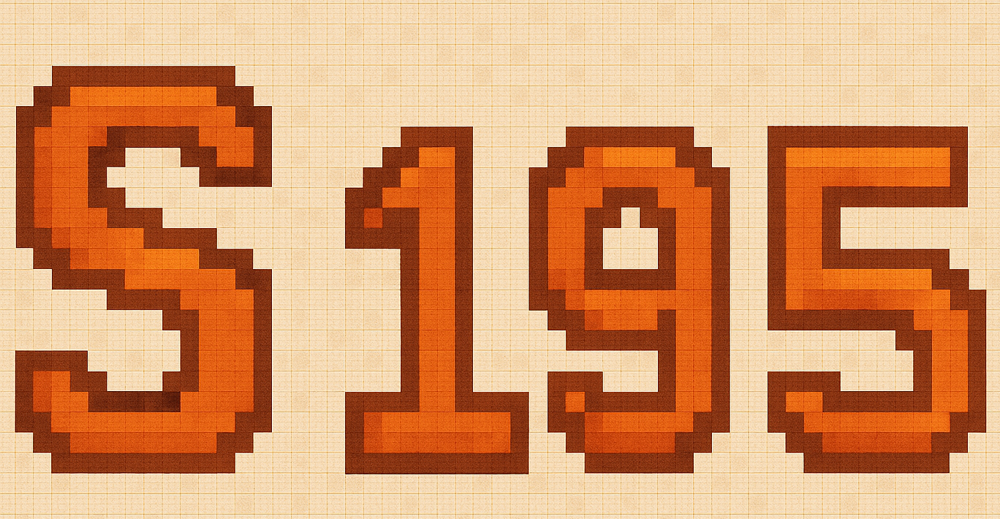

### 👋 Acerca de mí

¡Hola! Soy Stuarth, estudiante de **Ingeniería en Computadores** en el **Tecnológico de Costa Rica (TEC)**.
Me apasiona el mundo de los **circuitos electrónicos** y el **desarrollo backend**, dos áreas en las que busco especializarme y crecer profesionalmente.

Mi enfoque va más allá de solo escribir código; me interesa cómo el hardware y el software se conectan para crear soluciones reales. Por eso, combino mis estudios en electrónica con proyectos de programación, especialmente en el backend, donde disfruto diseñar sistemas robustos, eficientes y bien estructurados.

### 🚀 Objetivos

* Desarrollar proyectos que integren la electrónica con la programación.
* Profundizar en arquitecturas backend modernas.
* Compartir mis aprendizajes y avances a través de GitHub.

---

### 👋 About Me

Hi! I'm Stuarth, a student of **Computer Engineering** at the **Tecnológico de Costa Rica (TEC)**.
I'm passionate about **electronic circuits** and **backend development**, two areas where I aim to specialize and grow professionally.

My approach goes beyond just writing code — I'm interested in how hardware and software come together to create real-world solutions. That’s why I combine my studies in electronics with programming projects, especially in backend development, where I enjoy designing robust, efficient, and well-structured systems.

### 🚀 Goals

* Build projects that integrate electronics and software.
* Deepen my knowledge in modern backend architectures.
* Share my learning journey and progress through GitHub.

